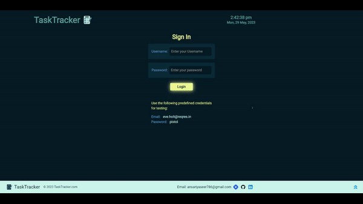
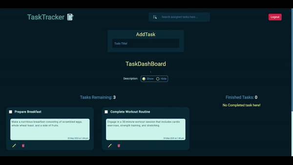
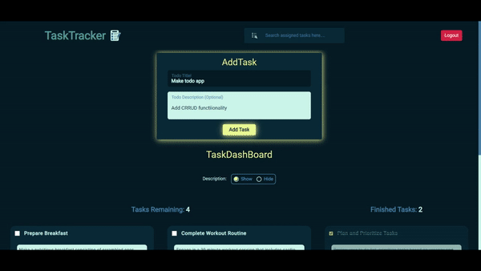
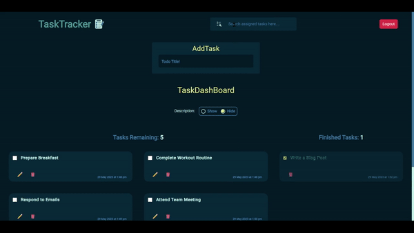
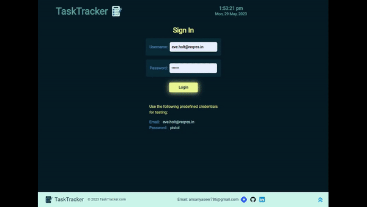

# Frontend Project: TaskTracker App

TaskTracker is a modern web application built with **React**, **React Router**, & **Bootstrap**. It offers a comprehensive task management solution, empowering users to efficiently organize & track their tasks.

## Introduction

TaskTracker allows users to **log in** & **log out**, ensuring secure access to their task data. The login functionality authenticates users based on their email & password, granting them access to their personalized task dashboard. With TaskTracker, users can **create**, **edit**, & **delete** tasks, as well as mark tasks as **completed**. The app leverages **local storage** to store task data, ensuring that users can access their tasks even after closing the browser.

---

## Technologies Used

- **React:** A popular JavaScript library for building user interfaces.
- **React Router:** A library for handling routing in a React application.
- **Bootstrap:** A CSS framework that provides styles for responsive web design.
- **Axios:** A library used for making HTTP requests to the API.
- **LocalStorage:** The browser's local storage mechanism used for storing tasks locally.
- **React-Bootstrap:** A library that integrates Bootstrap components into a React application.
- **react-toastify:** A library used for displaying notifications in the application.

---

## Demo

You can also see a live demo of this project here.

Or click the link below If above button doesn't work:

https://todo-app-ansari-yasir.netlify.app

## **Features:**

### **1. Walk Around of App:**

- **User Authentication:** Secure login & logout functionality to protect user data.
  ## 

### **2. Adding Tasks:**

- **Task Creation:** Easily create new tasks & assign them relevant details, such as title, description, & date.
  ## 

### **3. CRUD functionalities:**

- **Task Editing:** Update task details, modify dates, & make changes as needed.
- **Task Deletion:** Remove completed or unnecessary tasks from the dashboard.
- **Task Completion:** Mark tasks as completed to track progress & stay organized.
  ## 

### **4. Searching Tasks:**

- **Search Functionality:** Search for specific tasks using the built-in search bar, allowing users to quickly find the information they need.
  ## 

### **5. Responsiveness of the App:**

- **Responsive Design:** TaskTracker is fully responsive & compatible with various screen sizes, ensuring a seamless experience on desktop, tablet, & mobile devices.
  ## 

---

## Installation

To run the project, follow these steps:

1.  Clone the repository:

        git clone <repository-url>

2.  Install the npm package:

        npm install

3.  Install React Bootstrap for using Bootstrap components:

        npm install react-bootstrap bootstrap

4.  Install React Router:

        npm install react-router-dom localforage match-sorter sort-by

5.  Install PropTypes for type checking:

        npm install prop-types

6.  Install Axios for making API requests:

        npm install axios

7.  Install React Toastify for notifications:

        npm install --save react-toastify

---

**_Efficient, intuitive, & feature-rich, TaskTracker simplifies task management, helping users stay organized & focused on their goals. Experience the power of TaskTracker today & take control of your tasks like never before!_**
